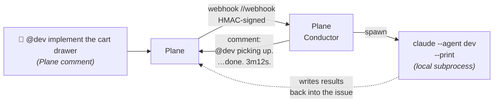

# Plane Conductor

[](https://github.com/volodchenkov/plane-conductor/actions/workflows/ci.yml)
[](pyproject.toml)
[](LICENSE)
[](https://github.com/astral-sh/ruff)
[](pyproject.toml)

> **Self-hosted Agent OS for any task-tracker-driven workflow.**
> Plane as the tracker, Claude Code as the runtime — turn your agents into a production-ready team. SDLC pack and content/research patterns coming as separate repos.

---



What it looks like once a mention lands:

```text
$ journalctl -u plane-conductor -f
… POST /qsale/webhook 200
… agent_spawned   workspace=qsale nickname=dev issue=6f042494 pid=500013
… (3m12s later)
… agent_exited    workspace=qsale nickname=dev exit_code=0 duration_s=192.4
```

Plane shows one comment that was posted at spawn and then *edited* on
exit:

> **`@dev` picking up.** Working on it — this comment will be updated when the agent finishes.
>
> *(3m12s later, edited:)*
>
> **`@dev` done.** Duration: 3m12s.

---

## What it does

You drop a YAML per workspace into `conductor.d/`. Each file is
self-contained: Plane creds, project, secrets, plus the agent roster
for that workspace's workflow. Each agent maps a `<nickname>` to a
`<prompt-role>.md` file in that workspace's prompts dir, and becomes a
bot account in Plane.

Mention `@<nickname>` in any issue comment — Plane sends a webhook to
`https://<host>/<workspace_slug>/webhook`. Plane Conductor verifies the
signature with that workspace's secret, resolves the mention, and
spawns `claude --agent <nickname> --print` on the host. The agent's
prompt file is what defines its behaviour; the orchestrator just runs
the subprocess and reports the outcome back into Plane.

The roster is yours and the workflow is yours: 10 SDLC roles, 5
content roles, 3 research roles — whatever stages your team has. The
orchestrator itself is workflow-agnostic.

**Multi-workspace, single process** — one host serves N workspaces
(nginx-vhost style, one YAML per workspace). Run an SDLC team and a
content team on the same box without spinning up two services.

---

## Quick start

```bash
git clone https://github.com/volodchenkov/plane-conductor.git
cd plane-conductor
python -m venv .venv && source .venv/bin/activate
pip install -e .

# 1. Host-wide runtime knobs (port, log dir, capacity).
cp examples/runtime.env.example runtime.env

# 2. One self-contained YAML per workspace. Filename stem MUST match
#    the workspace_slug field inside.
mkdir -p conductor.d
cp examples/conductor.d/minimal.yaml conductor.d/myws.yaml
# Edit conductor.d/myws.yaml — fill plane_base_url, plane_api_key,
# project_id, initiator_uuid, webhook_secret (openssl rand -hex 32),
# email_domain, prompts_dir. chmod 600 (it has secrets).

export CONDUCTOR_DIR=$(pwd)/conductor.d

plane-conductor verify       # smoke check (all workspaces)
plane-conductor setup        # invite bots + create labels (all workspaces)
plane-conductor serve        # listens on :8000 by default
```

In Plane, configure the workspace's webhook to
`https://<your-host>/<workspace_slug>/webhook` with the same
`webhook_secret`. Mention an agent and the orchestrator picks it up.

Adding a second workspace? Drop another file into `conductor.d/`,
restart, point Plane's webhook for it at
`/<other-workspace-slug>/webhook`. No code changes.

For the full systemd-installer / Docker / tunnel walkthrough, see
[**docs/install.md**](docs/install.md). For every config knob, see
[**docs/configuration.md**](docs/configuration.md).

---

## What you get

- **Webhook-driven, single-binary orchestrator.** No DB, no Redis, no
  queue. State is in-memory while running, sentinel files on disk for
  restart recovery, everything else lives in Plane.
- **Multi-workspace** — one process serves N workspaces (nginx-vhost
  style). One YAML per workspace in `conductor.d/`, one webhook URL
  per workspace, isolated HMAC secrets. Add a workspace by dropping a
  file; remove one by deleting it.
- **Two-tier config** — `runtime.env` for host-wide knobs (port, log
  dir, capacity); `conductor.d/<slug>.yaml` for each workspace's Plane
  creds + agents + labels + secrets.
- **Idempotent setup tooling** — `plane-conductor setup` invites every
  configured bot account and creates every configured label / state.
  Use `--workspace <slug>` to scope, omit to run for all. Re-runs are safe.
- **Production-grade subprocess handling** — process groups, SIGTERM →
  SIGKILL escalation on timeout, host-wide capacity cap, dedup of
  same-issue same-agent races (workspace-aware), restart recovery with
  comment-back-to-the-right-Plane, graceful shutdown for systemd.
- **Instant feedback in Plane** — `announce_spawn=true` posts a
  "picking up…" comment the moment the subprocess starts, and *edits*
  it on exit with duration + outcome. One comment per run.
- **Type-checked, tested, lint-clean** — mypy strict, ruff, ~100 unit +
  integration tests, e2e gated by `PLANE_E2E=1`. CI runs the matrix
  on Python 3.11 / 3.12 / 3.13.

---

## Documentation

- [**docs/architecture.md**](docs/architecture.md) — how the pieces fit
  (Mermaid sequence + component diagrams, what runs where, what
  defends what failure mode).
- [**docs/why.md**](docs/why.md) — why this and not n8n / GitHub
  Actions / a 200-line FastAPI script. Honest comparison and "when not
  to use it".
- [**docs/install.md**](docs/install.md) — local + systemd + Docker,
  webhook exposure (Cloudflare Tunnel / nginx).
- [**docs/configuration.md**](docs/configuration.md) — every `.env`
  variable and every YAML field, with examples.
- [**CHANGELOG.md**](CHANGELOG.md) — release notes.
- [**CONTRIBUTING.md**](CONTRIBUTING.md) — dev setup, PR flow, lint
  commands.
- [**SECURITY.md**](SECURITY.md) — vulnerability reporting + hardening
  notes.
- [**docs/internals/**](docs/internals/) — bootstrap design artifacts
  (REQUIREMENTS / SPEC at v0.1). Useful for understanding the *why*
  behind decisions; not living docs.

---

## Status

`v0.1` — works end-to-end against a self-hosted Plane instance.
Production patterns are in place; the API surface (CLI, env vars, YAML
schema) may still evolve before `v1`. Pin a tag if you depend on it.

---

## License

[MIT](LICENSE) © 2026 Dmitry Volodchenkov
