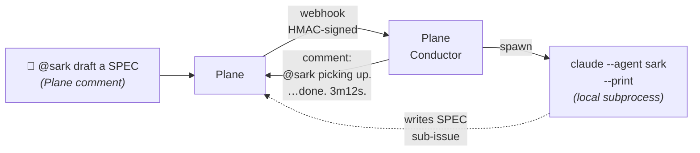

# Plane Conductor

[](https://github.com/volodchenkov/plane-conductor/actions/workflows/ci.yml)
[](pyproject.toml)
[](LICENSE)
[](https://github.com/astral-sh/ruff)
[](pyproject.toml)

> **Self-hosted Agent OS for any task-tracker-driven workflow.**
> Plane as the tracker, Claude Code as the runtime — turn your agents into a production-ready team. SDLC pack and content/research patterns coming as separate repos.

---



What it looks like once a mention lands:

```text
$ journalctl -u plane-conductor -f
… POST /webhook 200
… agent_spawned   nickname=sark issue=6f042494 pid=500013
… (3m12s later)
… agent_exited    nickname=sark exit_code=0 duration_s=192.4
```

Plane shows one comment that was posted at spawn and then *edited* on
exit:

> **`@sark` picking up.** Working on it — this comment will be updated when the agent finishes.
>
> *(3m12s later, edited:)*
>
> **`@sark` done.** Duration: 3m12s.

---

## What it does

You configure a roster of agents in `conductor.yaml` (e.g. `castor →
business-analyst`, `sark → system-analyst`, …). Each becomes a bot
account in Plane. Mention `@<nickname>` in any issue comment — Plane
sends a webhook, Plane Conductor verifies the signature, resolves the
mention, and spawns `claude --agent <nickname> --print` on the host
that runs the service. The agent's prompt file (`<role>.md` in your
local `PROMPTS_DIR`) is what defines its behaviour; the orchestrator
just runs the subprocess and reports the outcome back into Plane.

The roster is yours: 10 SDLC roles, 5 content roles, 3 research roles
— whatever stages your team has. The orchestrator itself is workflow-
agnostic.

---

## Quick start

```bash
git clone https://github.com/volodchenkov/plane-conductor.git
cd plane-conductor
python -m venv .venv && source .venv/bin/activate
pip install -e .

cp .env.example .env
# fill PLANE_*, WEBHOOK_SECRET (openssl rand -hex 32), EMAIL_DOMAIN,
# PROMPTS_DIR, INITIATOR_UUID, CONDUCTOR_CONFIG.

cp examples/sdlc-conductor.yaml conductor.yaml
# Or examples/minimal-conductor.yaml for a single-agent setup.

plane-conductor verify       # smoke check Plane connectivity
plane-conductor setup        # invite configured bots + create labels
plane-conductor serve        # listens on :8000 by default
```

Then point a Plane webhook at `https://<your host>/webhook` (use
[Cloudflare Tunnel](https://developers.cloudflare.com/cloudflare-one/connections/connect-networks/)
or any reverse proxy if you're behind NAT) and mention an agent.

For the full systemd-installer / Docker / tunnel walkthrough, see
[**docs/install.md**](docs/install.md). For every config knob, see
[**docs/configuration.md**](docs/configuration.md).

---

## What you get

- **Webhook-driven, single-binary orchestrator.** No DB, no Redis, no
  queue. State is in-memory while running, sentinel files on disk for
  restart recovery, everything else lives in Plane.
- **Two-file config** — `.env` for runtime concerns, `conductor.yaml`
  for the workflow (agents, labels, states, behaviour).
- **Idempotent setup tooling** — `plane-conductor setup` invites every
  configured bot account and creates every configured label / state in
  one command. Re-runs are safe.
- **Production-grade subprocess handling** — process groups, SIGTERM →
  SIGKILL escalation on timeout, capacity caps, dedup of same-issue
  same-agent races, restart recovery with comment-back-to-Plane,
  graceful shutdown for systemd.
- **Instant feedback in Plane** — `announce_spawn=true` posts a
  "picking up…" comment the moment the subprocess starts, and *edits*
  it on exit with duration + outcome. One comment per run.
- **Type-checked, tested, lint-clean** — mypy strict, ruff, ~90 unit +
  integration tests, e2e gated by `PLANE_E2E=1`. CI runs the matrix
  on Python 3.11 / 3.12 / 3.13.

---

## Documentation

- [**docs/architecture.md**](docs/architecture.md) — how the pieces fit
  (Mermaid sequence + component diagrams, what runs where, what
  defends what failure mode).
- [**docs/why.md**](docs/why.md) — why this and not n8n / GitHub
  Actions / a 200-line FastAPI script. Honest comparison and "when not
  to use it".
- [**docs/install.md**](docs/install.md) — local + systemd + Docker,
  webhook exposure (Cloudflare Tunnel / nginx).
- [**docs/configuration.md**](docs/configuration.md) — every `.env`
  variable and every YAML field, with examples.
- [**CHANGELOG.md**](CHANGELOG.md) — release notes.
- [**CONTRIBUTING.md**](CONTRIBUTING.md) — dev setup, PR flow, lint
  commands.
- [**SECURITY.md**](SECURITY.md) — vulnerability reporting + hardening
  notes.
- [**docs/internals/**](docs/internals/) — bootstrap design artifacts
  (REQUIREMENTS / SPEC at v0.1). Useful for understanding the *why*
  behind decisions; not living docs.

---

## Status

`v0.1` — works end-to-end against a self-hosted Plane instance.
Production patterns are in place; the API surface (CLI, env vars, YAML
schema) may still evolve before `v1`. Pin a tag if you depend on it.

---

## License

[MIT](LICENSE) © 2026 Dmitry Volodchenkov
