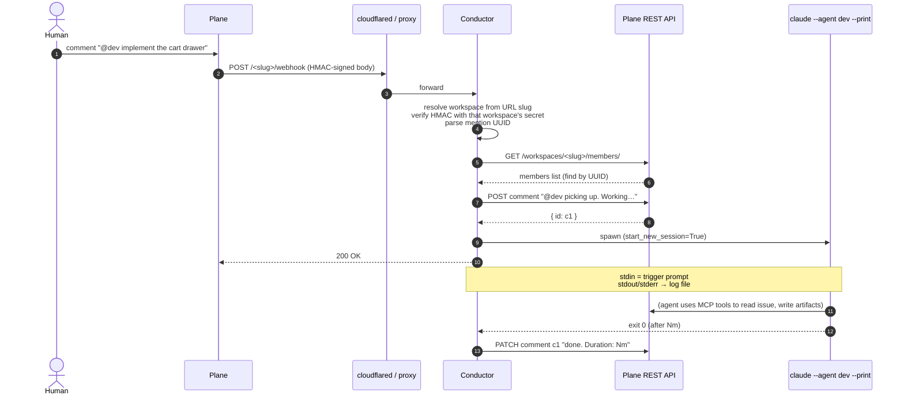
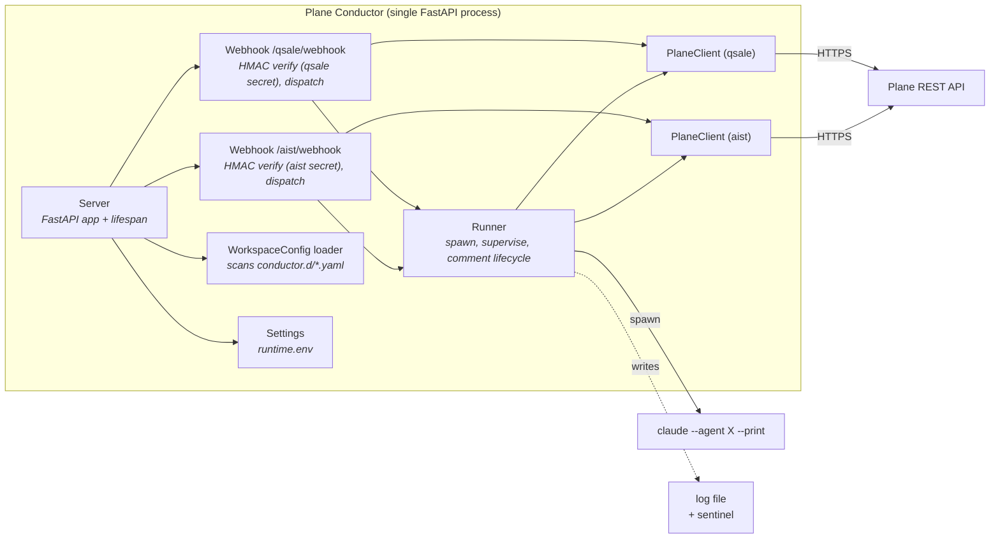

# Architecture

Plane Conductor is a single-process FastAPI service that translates Plane
webhooks into local `claude` subprocesses, supervises them to completion,
and reports outcomes back into Plane.

It holds **no persistent state**. Everything it remembers is what's
currently running (in three small in-memory sets) plus per-run log files
on disk. That's it.

It serves **N workspaces from one process** (nginx-vhost style): each
workspace is one self-contained YAML in `conductor.d/` with its own Plane
creds, project, agents, and webhook secret. The webhook is dispatched by
URL path: `POST /<workspace_slug>/webhook`.

---

## What happens when you mention an agent

Sequence diagram of one mention, end-to-end:



Key points:

- The webhook handler returns **200 immediately** after spawning. The
  agent's actual work runs in a supervisor task; Plane is not kept
  waiting on a long-lived HTTP request.
- The `picking up…` comment is posted *before* the subprocess inherits
  control, so the human sees instant feedback even if the agent itself is
  slow to produce output.
- That same comment is **updated** when the agent exits (success → done +
  duration; non-zero → error + duration). The conductor never posts a
  separate "failed" note when the announce flow is on; it edits the
  existing one.
- HMAC verification is **per workspace**: each workspace has its own
  secret in its YAML, so a leaked secret only compromises one tenant.

---

## Internal components



### Server (`server.py`)

FastAPI app factory. On startup it loads every `*.yaml` in
`settings.conductor_dir` into a `dict[slug, WorkspaceConfig]`, builds one
`PlaneClient` per workspace, mounts a `/<slug>/webhook` route per
workspace, and exposes `GET /health` (which lists the loaded slugs).
The `lifespan` runs [restart recovery](#restart-recovery) on startup and
waits for in-flight agents on shutdown (with a configurable grace
window), then closes every `PlaneClient`.

### Webhook handler (`webhook.py`)

One route per workspace, mounted as `POST /<slug>/webhook`. Each route
closes over its own workspace config + Plane client, so they run
independently. Steps inside the route:

1. Constant-time HMAC-SHA256 verification of the raw body against
   that workspace's `webhook_secret`.
2. Parse JSON; ignore everything except `issue_comment` events with
   `created` or `updated` action.
3. Extract every `<mention-component entity_identifier="<UUID>">` from
   `comment_html` (regex, document order, dedup).
4. For each UUID: skip the workspace's `initiator_uuid` (the human),
   resolve the rest to emails via `PlaneClient.get_member()`, split the
   local-part to a nickname, look it up in this workspace's `agents`
   list, and dispatch to the runner with `(workspace, plane)` context.
5. On a *transient* Plane API error (5xx / network) return **503** so
   Plane retries the webhook delivery. On a permanent error (4xx) skip
   the offending mention and return **200** with a `skipped[]` report.

### Runner (`runner.py`)

One shared `Runner` for all workspaces. The host-wide capacity cap
(`MAX_CONCURRENT_SESSIONS`) counts agents across every workspace. Per-spawn
it:

- Checks dedup on `(workspace_slug, nickname, issue_uuid)` — the slug is in
  the key so two workspaces can share nicknames safely
- Checks capacity (`MAX_CONCURRENT_SESSIONS` ceiling → reject)
- Opens a per-run log file `logs/<ts>-<slug>-<nick>-<issue>.log`
- `asyncio.create_subprocess_exec(claude, --agent, X, --print,
  start_new_session=True, stdin=PIPE, stdout=log, stderr=log,
  cwd=workspace.agent_working_dir)` — process group of its own
- Pipes a 5-line trigger prompt to stdin, closes stdin
- Optionally posts the `picking up…` announce comment via that workspace's
  Plane client
- Writes a sentinel JSON file under
  `logs/.active/<slug>-<nick>-<issue>.json` (carries the slug so recovery
  knows where to comment)
- Spawns an `asyncio.Task` (the *supervisor*) that awaits exit

The supervisor:

- `wait_for(proc.wait(), timeout=SESSION_TIMEOUT_SECONDS)`
- On timeout: `killpg(SIGTERM)` then SIGKILL after 5s — the whole process
  group, so `claude`'s descendants (MCP servers, helper procs) die too
- On exit: closes the log fp, releases the subprocess transport,
  removes the sentinel, updates the announce comment (or posts a fresh
  failure note when announce was off / failed)
- All bookkeeping sets (`_active`, `_procs`, `_tasks`) self-clean

### PlaneClient (`plane_client.py`)

Async `httpx.AsyncClient` wrapper. One instance per workspace (each
carries its own base URL + API key + workspace slug). Only uses Plane v1
endpoints that work with a **workspace API key**:

- `GET /workspaces/<slug>/projects/` — used by `ping()` (workspace check)
- `GET /workspaces/<slug>/members/` — used by member-by-UUID lookup
- `GET/POST /workspaces/<slug>/projects/<pid>/labels/`
- `GET/POST /workspaces/<slug>/projects/<pid>/states/`
- `GET /workspaces/<slug>/projects/<pid>/work-items/<id>/` and
  `POST/PATCH .../comments/` for the announce flow

### WorkspaceConfig + Settings (`conductor_config.py`, `config.py`)

Two separate configuration sources. See [`configuration.md`](configuration.md)
for the full schema.

- `Settings` (env-driven) — host-wide runtime: ports, log dir, capacity,
  timeouts, claude binary, conductor.d/ path.
- `WorkspaceConfig` (one YAML per workspace) — Plane creds, project,
  initiator UUID, webhook secret, prompts dir, agent working dir, agents,
  labels, states, behaviour flags.

---

## Resilience: what can go wrong, what defends

| Failure mode | Defence |
|---|---|
| Plane retries the same webhook (at-least-once delivery) or human double-mentions | Dedup on `(workspace_slug, nickname, issue_uuid)` — second `runner.spawn()` raises `SessionAlreadyRunningError`, webhook reports `skipped` and returns 200. |
| Mention storm melts the box / blows the API quota | `MAX_CONCURRENT_SESSIONS` cap, host-wide across all workspaces — N+1th spawn raises `CapacityFullError`. |
| Agent (or its MCP server / helper procs) hangs past timeout | Process group spawned with `start_new_session=True`; on timeout `killpg(SIGTERM)` then SIGKILL after 5s — kills the whole tree. |
| Plane API has a transient hiccup during member lookup | Webhook returns **503** instead of 200 — Plane retries the delivery. 4xx errors are not retried (genuine misconfigs surface as `skipped`). |
| systemd `TimeoutStopSec` kills agents mid-flight | `SHUTDOWN_GRACE_SECONDS` (default 30s) lets them finish first; only after the grace window does `wait_idle()` SIGKILL the remaining process groups. |
| Conductor crashes / is restarted while an agent was running | Sentinel file `logs/.active/<slug>-<nick>-<issue>.json` survives. On startup the lifespan calls `recover_orphaned_sessions()`, posts a recovery comment to the **right** workspace (looked up by slug from the sentinel), removes the sentinel. Sentinels referencing now-removed workspaces are dropped silently. |
| Agent slow to produce its own startup comment / falls over silently | `announce_spawn=true` posts a "picking up…" comment immediately on spawn and updates it on exit. Surface signal independent of agent behaviour. |
| Webhook secret leaks for one workspace | Each workspace has its own secret; the leak doesn't grant access to others. The URL path `/<slug>/webhook` is also workspace-scoped. |

### Restart recovery

Every spawned subprocess gets a sentinel file with `{workspace_slug,
nickname, issue_uuid, log_path, started_at}`. On clean exit it's removed;
on a process kill (kernel OOM, container restart, machine reboot) it
stays. At next startup the server iterates `logs/.active/`, looks up the
sentinel's `workspace_slug` in the loaded workspaces, and posts a comment
to the affected issue via the matching Plane client. The human sees what
was running and can re-mention to continue.

---

## What's *not* in scope

- **Agent state** — Plane Conductor doesn't track conversation history,
  agent memory, or partial progress. Each spawn is fresh; the agent's
  own prompt + Plane's issue/comment thread are the source of truth.
- **Re-entry / continuation logic** — same reason. The orchestrator
  spawns; the agent decides whether this is a first run, a continuation,
  or a rework. See your `<role>.md` prompt for that logic.
- **Per-workspace isolation** (process / network / FS sandboxing) —
  multi-workspace is shared-process, shared-capacity. This is a
  pet-project orchestrator, not a multi-tenant SaaS; the host trusts
  every workspace it serves. Run separate hosts if you need isolation.
- **Persistence** — no DB, no Redis. State lives in Plane (issues,
  sub-issues, comments) and on disk (logs, sentinels).
- **Distributed deployment** — single process, single host. Add Redis
  + a coordinator if you ever need multi-instance, but most users
  won't.

---

## File layout

```
src/plane_conductor/
├── __main__.py            # python -m plane_conductor → cli
├── cli.py                 # typer app: serve / setup / verify / agents (--workspace <slug>)
├── config.py              # Settings (env-driven, host-wide runtime concerns)
├── conductor_config.py    # WorkspaceConfig + load_workspaces(dir)
├── exceptions.py          # PlaneAPIError, AgentSpawnError, SessionAlreadyRunningError, CapacityFullError
├── logging_config.py      # structlog setup (pretty + json renderers)
├── plane_client.py        # async httpx wrapper for the Plane v1 REST API
├── runner.py              # Runner + supervisor + sentinel helpers + recovery
├── server.py              # FastAPI app factory + lifespan (multi-workspace mount)
├── webhook.py             # POST /<slug>/webhook handlers
└── setup/plane/           # idempotent bootstrap (users, labels, states) per workspace

setup/install.sh           # systemd installer
examples/
  runtime.env.example      # host-wide runtime template
  conductor.d/             # per-workspace YAML templates
    sdlc.yaml
    minimal.yaml
    content.yaml
  Dockerfile, docker-compose.yml, nginx.conf
tests/                     # 99 unit tests + e2e (gated by PLANE_E2E=1)
```
