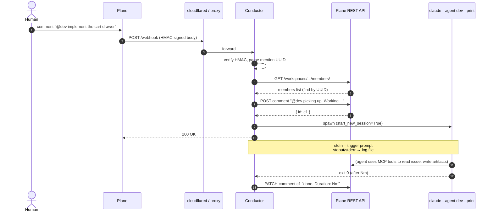
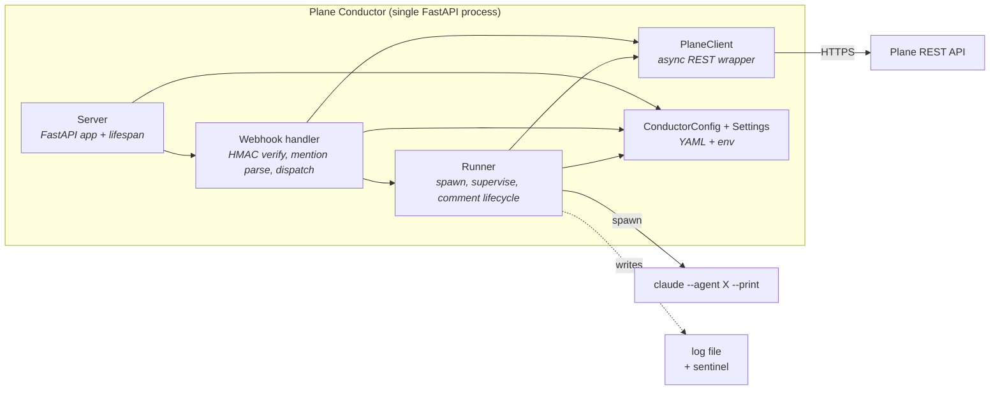

# Architecture

Plane Conductor is a single-process FastAPI service that translates Plane
webhooks into local `claude` subprocesses, supervises them to completion,
and reports outcomes back into Plane.

It holds **no persistent state**. Everything it remembers is what's
currently running (in three small in-memory sets) plus per-run log files
on disk. That's it.

---

## What happens when you mention an agent

Sequence diagram of one mention, end-to-end:



Key points:

- The webhook handler returns **200 immediately** after spawning. The
  agent's actual work runs in a supervisor task; Plane is not kept
  waiting on a long-lived HTTP request.
- The `picking up…` comment is posted *before* the subprocess inherits
  control, so the human sees instant feedback even if the agent itself is
  slow to produce output.
- That same comment is **updated** when the agent exits (success → done +
  duration; non-zero → error + duration). The conductor never posts a
  separate "failed" note when the announce flow is on; it edits the
  existing one.

---

## Internal components



### Server (`server.py`)

FastAPI app factory. Builds `PlaneClient`, `Runner`, mounts the webhook
router, and exposes `GET /health`. The `lifespan` runs
[restart recovery](#restart-recovery) on startup and waits for in-flight
agents on shutdown (with a configurable grace window).

### Webhook handler (`webhook.py`)

A single `POST /webhook` route. Steps:

1. Constant-time HMAC-SHA256 verification of the raw body against
   `WEBHOOK_SECRET`.
2. Parse JSON; ignore everything except `issue_comment` events with
   `created` or `updated` action.
3. Extract every `<mention-component entity_identifier="<UUID>">` from
   `comment_html` (regex, document order, dedup).
4. For each UUID: skip the configured `INITIATOR_UUID` (the human),
   resolve the rest to emails via `PlaneClient.get_member()`, split the
   local-part to a nickname, look it up in the `agents:` section of
   `conductor.yaml`, and dispatch to the runner.
5. On a *transient* Plane API error (5xx / network) return **503** so
   Plane retries the webhook delivery. On a permanent error (4xx) skip
   the offending mention and return **200** with a `skipped[]` report.

### Runner (`runner.py`)

Spawns subprocesses and keeps them alive correctly. Per-spawn it:

- Checks dedup (`(nickname, issue_uuid)` already in flight → reject)
- Checks capacity (`MAX_CONCURRENT_SESSIONS` ceiling → reject)
- Opens a per-run log file `logs/<ts>-<nick>-<issue>.log`
- `asyncio.create_subprocess_exec(claude, --agent, X, --print,
  start_new_session=True, stdin=PIPE, stdout=log, stderr=log)` —
  process group of its own
- Pipes a 5-line trigger prompt to stdin, closes stdin
- Optionally posts the `picking up…` announce comment via PlaneClient
- Writes a sentinel JSON file under `logs/.active/<id>.json`
- Spawns an `asyncio.Task` (the *supervisor*) that awaits exit

The supervisor:

- `wait_for(proc.wait(), timeout=SESSION_TIMEOUT_SECONDS)`
- On timeout: `killpg(SIGTERM)` then SIGKILL after 5s — the whole process
  group, so `claude`'s descendants (MCP servers, helper procs) die too
- On exit: closes the log fp, releases the subprocess transport,
  removes the sentinel, updates the announce comment with the outcome
- All bookkeeping sets (`_active`, `_procs`, `_tasks`) self-clean

### PlaneClient (`plane_client.py`)

Async `httpx.AsyncClient` wrapper. Only uses Plane v1 endpoints that work
with a **workspace API key**:

- `GET /workspaces/<slug>/projects/` — used by `ping()` (workspace check)
- `GET /workspaces/<slug>/members/` — used by member-by-UUID lookup
- `GET/POST /workspaces/<slug>/projects/<pid>/labels/`
- `GET/POST /workspaces/<slug>/projects/<pid>/states/`
- `GET /workspaces/<slug>/projects/<pid>/work-items/<id>/` and
  `POST/PATCH .../comments/` for the announce flow

### ConductorConfig + Settings (`conductor_config.py`, `config.py`)

Two separate configuration sources — runtime vs workflow. See
[`configuration.md`](configuration.md) for the full schema.

- `Settings` (env-driven) — secrets, ports, paths, log dir, capacity.
- `ConductorConfig` (YAML) — agent roster, label list, state list,
  behaviour flags (`announce_spawn`).

---

## Resilience: what can go wrong, what defends

| Failure mode | Defence |
|---|---|
| Plane retries the same webhook (at-least-once delivery) or human double-mentions | Dedup on `(nickname, issue_uuid)` — second `runner.spawn()` raises `SessionAlreadyRunningError`, webhook reports `skipped` and returns 200. |
| Mention storm melts the box / blows the API quota | `MAX_CONCURRENT_SESSIONS` cap — N+1th spawn raises `CapacityFullError`. |
| Agent (or its MCP server / helper procs) hangs past timeout | Process group spawned with `start_new_session=True`; on timeout `killpg(SIGTERM)` then SIGKILL after 5s — kills the whole tree. |
| Plane API has a transient hiccup during member lookup | Webhook returns **503** instead of 200 — Plane retries the delivery. 4xx errors are not retried (genuine misconfigs surface as `skipped`). |
| systemd `TimeoutStopSec` kills agents mid-flight | `SHUTDOWN_GRACE_SECONDS` (default 30s) lets them finish first; only after the grace window does `wait_idle()` SIGKILL the remaining process groups. |
| Conductor crashes / is restarted while an agent was running | Sentinel file `logs/.active/<nick>-<issue>.json` survives. On startup the lifespan calls `recover_orphaned_sessions()`, posts a recovery comment to each affected issue ("agent was running when the orchestrator restarted; mention me again"), removes the sentinel. |
| Agent slow to produce its own startup comment / falls over silently | `announce_spawn=true` posts a "picking up…" comment immediately on spawn and updates it on exit. Surface signal independent of agent behaviour. |

### Restart recovery

Every spawned subprocess gets a sentinel file with `{nickname,
issue_uuid, log_path, started_at}`. On clean exit it's removed; on a
process kill (kernel OOM, container restart, machine reboot) it stays.
At next startup the server iterates `logs/.active/` and posts a comment
to each leftover issue. The human sees what was running and can
re-mention to continue (the agent's prompt is responsible for
continuation/rework logic — Plane Conductor itself just reports the
interrupt).

---

## What's *not* in scope

- **Agent state** — Plane Conductor doesn't track conversation history,
  agent memory, or partial progress. Each spawn is fresh; the agent's
  own prompt + Plane's issue/comment thread are the source of truth.
- **Re-entry / continuation logic** — same reason. The orchestrator
  spawns; the agent decides whether this is a first run, a continuation,
  or a rework. See your `<role>.md` prompt for that logic.
- **Multi-tenancy** — one orchestrator instance serves one workspace.
  Run separate processes for separate workspaces.
- **Persistence** — no DB, no Redis. State lives in Plane (issues,
  sub-issues, comments) and on disk (logs, sentinels).
- **Distributed deployment** — single process, single host. Add Redis
  + a coordinator if you ever need multi-instance, but most users
  won't.

---

## File layout

```
src/plane_conductor/
├── __main__.py            # python -m plane_conductor → cli
├── cli.py                 # typer app: serve / setup / verify / agents
├── config.py              # Settings (env-driven, runtime concerns)
├── conductor_config.py    # ConductorConfig (YAML, workflow concerns)
├── exceptions.py          # PlaneAPIError, AgentSpawnError, SessionAlreadyRunningError, CapacityFullError
├── logging_config.py      # structlog setup (pretty + json renderers)
├── plane_client.py        # async httpx wrapper for the Plane v1 REST API
├── runner.py              # Runner + supervisor + sentinel helpers
├── server.py              # FastAPI app factory + lifespan
├── webhook.py             # POST /webhook handler
└── setup/plane/           # idempotent bootstrap (users, labels, states)

setup/install.sh           # one-shot systemd installer
examples/                  # sdlc-conductor.yaml, minimal-conductor.yaml, Dockerfile, nginx.conf
tests/                     # 92 tests; e2e gated by PLANE_E2E=1
```
